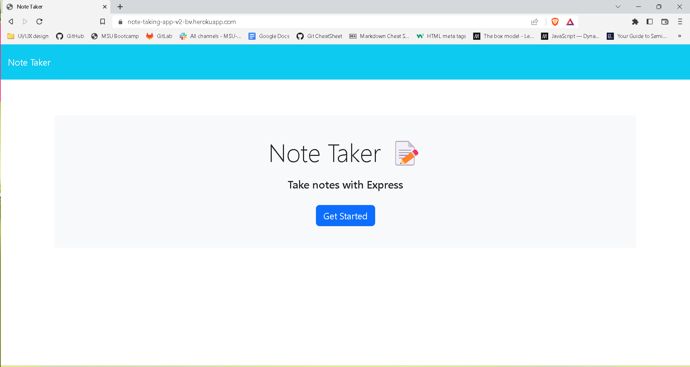

# Note Taking Application

  []

  
  ## Description 
  
  This project was implemented to give users an easy-to-use option for taking notes on a web browser. 

  Link to application: https://note-taking-app-v2-bv.herokuapp.com/
  

  
  ## Table of Contents

  ⋆[Installation](#Installation)
  ⋆[Usage](#Usage)
  ⋆[Credits](#Credits)
  ⋆[License](#License)
  ⋆[Features](#Features)
  ⋆[Contributions](#Contributions)
  ⋆[Test](#Contributions)

  ## Installation 

  N/A

  ## Usage

  Upon opening the application on a web browser, select 'Get Started.' Users can enter the title of the note in the text input labeled 'note title,' and the note content in the text input labeled 'note text.' When both text inputs have content, the save button will appear in the upper right hand corner, allowing the user to save the note.

  ## Credits 

  N/A

  ## License

  (https://opensource.org/licenses/MIT)
  

  ## Features

  N/A

  ## Contributions

  N/A

  ## Test

  N/A

  ## Questions

  If you have any questions about the project you can reach out to me via email or GitHub with the information below. 

  >Email: Brahmvanh@gmail.com

  >GitHub: [BrahmVanH](https://github.com/BrahmVanH)

